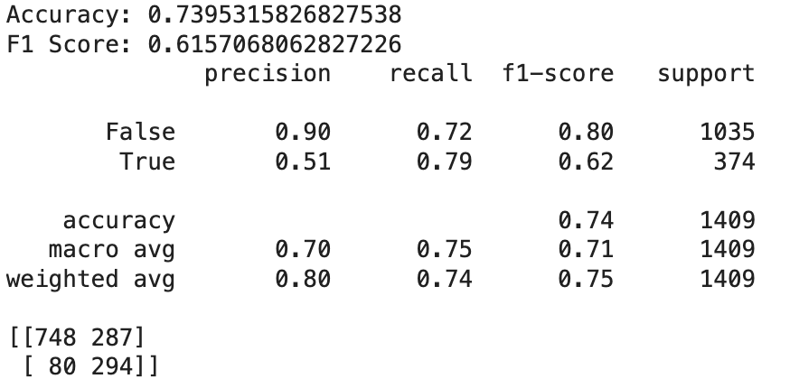
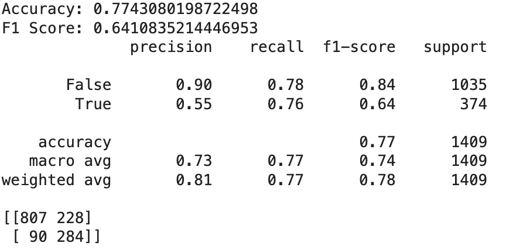

# Customer Churn Prediction  

## 📌 Project Workflow  

### 1. Data Cleaning & Preprocessing  
- Removed irrelevant columns and handled missing values.  
- Converted *Yes/No* categorical columns into `bool` type.  
- Reduced memory usage by approximately **80%**, making the dataset more efficient for modeling.  

### 2. Feature & Target Definition  
- **X (features):** all columns except the target.  
- **y (target):** the `Churn` column.  

### 3. Train/Test Split  
- Used `train_test_split` to split the dataset into training and testing sets.  
- Applied `stratify=y` to maintain the same distribution of churn labels in both sets.  

### 4. Pipeline Creation  
- Built a pipeline with a **ColumnTransformer** and a classifier.  
- **Preprocessing:**  
  - `OneHotEncoder` for categorical features.  
  - `StandardScaler` for numeric features.  

### 5. Initial Model Benchmarking (GridSearchCV)  
- Evaluated 4 classifiers with **5-fold cross-validation**:  
  - RandomForestClassifier  
  - LogisticRegression (`liblinear`)  
  - GradientBoostingClassifier  
  - Support Vector Machine (SVM)  
- Applied **`class_weight="balanced"`** (except GradientBoosting) due to imbalanced churn classes.  
- Optimized for **F1 Score** since accuracy alone would be misleading.  
- **Result:** Logistic Regression achieved the best performance in the initial stage.  

### 6. Model Evaluation  
- Reported metrics: **Accuracy**, **Precision**, **Recall**, and **F1 Score**.  
- Visualized results for better interpretability.

### 7. Feature Selection (Feature Importance)  
- Extracted the **top 8 most influential features**.  
- Removed less relevant features to improve efficiency and reduce noise.  

### 8. Second Round of Model Tuning  
- Re-ran preprocessing and GridSearchCV on the reduced feature set.  
- **Result:** RandomForestClassifier (200 estimators, max depth = 8) delivered the best performance.

### 9. Final Comparison & Insights  
- GradientBoostingClassifier had the **longest average training time**.  
- Between Logistic Regression and Random Forest:  
  - Random Forest required more training time.  
  - But achieved **~5% higher F1 Score**.  
- **Final Takeaway:** RandomForestClassifier provided the best trade-off between accuracy, robustness, and performance.  

---

## 📊 Results  
- **Baseline Best Model:** Logistic Regression (liblinear)  
- **Final Best Model after Feature Selection:** RandomForestClassifier (200 estimators, max_depth=8)

